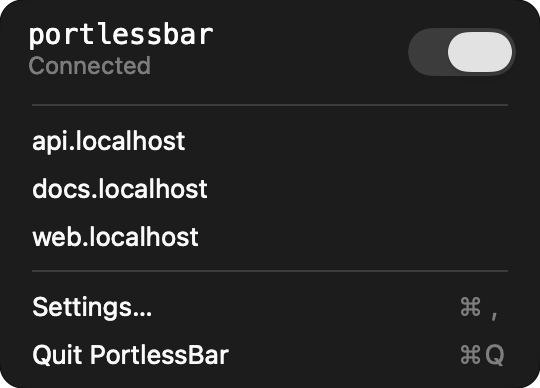

<p align="center">
  <a href="https://github.com/akshitkrnagpal/portlessbar/releases/latest">
    
  </a>
</p>

<h1 align="center">PortlessBar</h1>

<p align="center"><strong>Your localhost apps. One click away.</strong></p>

<p align="center">
  A tiny native macOS companion for <a href="https://github.com/vercel-labs/portless">Portless</a>.<br />
  Open your apps, toggle the proxy, and get back to work.
</p>

<p align="center">
  <a href="https://github.com/akshitkrnagpal/portlessbar/releases/latest"><strong>Download for macOS</strong></a> ·
  <a href="#get-started">Get started</a> ·
  <a href="https://github.com/akshitkrnagpal/portlessbar/issues">Support</a>
</p>

<p align="center">
  
  
  <a href="LICENSE"></a>
</p>

<br />

<p align="center">
  
</p>
<p align="center"><sub>Your Portless apps, right in the menu bar. Demo uses sample hostnames.</sub></p>

## Within reach

- **Open apps in one click.** Your current Portless registrations appear as URLs. Pick one to open it in your default browser.
- **One switch for the proxy.** Connect or disconnect without stopping your development servers. PortlessBar remembers the observed proxy configuration for reconnecting.
- **One switch for LAN mode.** Reach your apps from other devices on your network, or keep them on this Mac. Switching restarts the proxy; running apps get their new URLs when you restart them.
- **Ready when you log in.** Enable Launch at Login in Settings and keep your apps within reach throughout the day.
- **Feels at home on macOS.** A native menu, a monospace identity, and a small Settings screen.

## Get started

You need **macOS 14 or newer** and an existing [Portless installation](https://github.com/vercel-labs/portless) with its supported Node.js runtime. PortlessBar works alongside the CLI you already use.

1. [Download the universal app](https://github.com/akshitkrnagpal/portlessbar/releases/latest).
2. Unzip it and drag `PortlessBar.app` into **Applications**.
3. Open it, then click **`p_`** in your menu bar.

Run your development apps through Portless as usual. They appear in the menu automatically. Use the header switch to control the proxy and **Settings…** to enable Launch at Login.

Or install with Homebrew:

```sh
brew install --cask akshitkrnagpal/tap/portlessbar
```

The **download is Developer ID signed and notarized by Apple**, with support for both Apple Silicon and Intel. It checks for updates automatically and lets you review and install them in-app. Find update controls in **Settings…**. Older private beta builds need one manual replacement with the current download to enable the updater.

Complete Portless's initial proxy setup, certificate trust, and any required hosts configuration in Terminal first. macOS may ask for administrator approval when controlling a privileged proxy.

## Small by design

No account. No analytics. No extra dashboard to manage.

PortlessBar keeps the everyday controls in the menu bar. A compact Settings window fits Launch at Login, update preferences, and links to GitHub, X, and email without scrolling.

## Open source

Built in Swift, with [Sparkle](https://sparkle-project.org/) for signed in-app updates. Contributions, bug reports, and ideas are welcome.

To build locally with Swift 6 or newer:

```sh
git clone https://github.com/akshitkrnagpal/portlessbar.git
cd portlessbar
./scripts/build-app.sh
open dist/PortlessBar.app
```

See [Contributing](CONTRIBUTING.md) for development and tests, and [Security](SECURITY.md) for private vulnerability reports and administrator authorization details.

<details>
<summary>Compatibility and custom installations</summary>

Tested with **Portless 0.8.0 and 0.15.6**. Integration uses Portless's state files and process arguments, so other versions may need compatibility updates.

LAN mode needs a Portless version that has LAN mode; it was tested with 0.15.6. Turning LAN mode off returns to `.localhost`, so set a custom TLD again in Portless.

Custom CLI and registry paths can be supplied with `PORTLESSBAR_CLI` and `PORTLESS_STATE_DIR` when launching the app directly from Terminal; Finder and login launches do not inherit your shell's environment.

</details>

PortlessBar is an independent companion and is not affiliated with Vercel.

[Apache License 2.0](LICENSE) © 2026 Akshit Kr Nagpal. See [NOTICE](NOTICE) and [icon attribution](Assets/LinkIcons/README.md).

<p align="center">Made with ❤️ by <a href="https://akshit.io">akshit.io</a></p>
