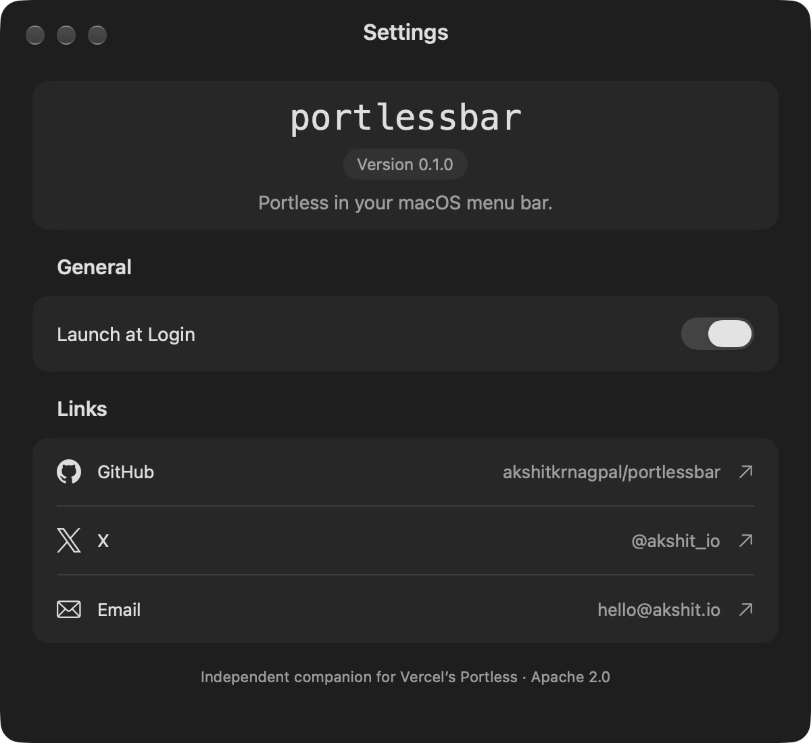

<p align="center">
  <a href="https://github.com/akshitkrnagpal/portlessbar/releases">
    
  </a>
</p>

<h3 align="center">PortlessBar</h3>

<p align="center">
  Portless in your macOS menu bar.
</p>

<p align="center">
  <a href="https://github.com/akshitkrnagpal/portlessbar/releases"><strong>Download</strong></a> ·
  <a href="#use"><strong>Usage</strong></a> ·
  <a href="https://github.com/akshitkrnagpal/portlessbar/issues"><strong>Support</strong></a> ·
  <a href="CONTRIBUTING.md"><strong>Contributing</strong></a>
</p>

<p align="center">
  
  
  <a href="LICENSE"></a>
</p>

<br />

A minimal native menu bar companion for [Vercel's Portless](https://github.com/vercel-labs/portless).

<p align="center">
  
</p>
<p align="center"><sub>Demo with sample hostnames. Click any server row to open its URL.</sub></p>

## Install

Requires **macOS 14 or newer**, the [Portless CLI](https://github.com/vercel-labs/portless) and its supported Node.js runtime. The universal app supports Apple Silicon and Intel.

1. Download the universal ZIP from [Releases](https://github.com/akshitkrnagpal/portlessbar/releases).
2. Unzip it and move `PortlessBar.app` into `/Applications`.
3. Open the app and click `p_` in your menu bar.

The 0.1.0 download is Developer ID signed and notarized by Apple. Updates are manual: quit the app and replace it with the latest download.

## Use

Run your development apps through Portless as usual. Click a registered hostname to open its URL in your default browser. Routes refresh immediately when opening the menu and every two seconds while it stays open.

The header switch starts or stops the **Portless proxy**. Turning it off leaves your development servers running. Reconnecting retains the observed port, HTTPS mode and available launch flags. Only current route registrations appear; server rows have no checkmarks or extra controls.

Open **Settings…** for **Launch at Login**, GitHub, X and Email. Login launch is off by default and reflects the actual macOS state. Move the app to `/Applications` before enabling it. If approval is required, the app opens Login Items in System Settings.

<p align="center">
  
</p>

Complete Portless certificate trust, hosts setup and initial proxy configuration in Terminal once before using the toggle. Starting a known privileged-port proxy or stopping a root-owned proxy presents the standard macOS administrator prompt. Connection and read failures appear under **Portless Error…**; read errors clear after recovery.

## Compatibility

Tested with **Portless 0.8.0 and 0.15.6**. Portless state files and process arguments are not a stable API, so other versions may require changes. Valid route records survive malformed neighbors and missing process IDs; invalid JSON is reported.

Background checks run every 15 seconds. The registry is read-only. Proxy configuration is saved in `~/Library/Application Support/PortlessBar/proxy.json`. Root-owned processes can hide launch arguments; configure custom certificates or unobservable flags in Terminal.

CLI discovery uses PATH, common package-manager directories and Node version-manager locations without loading shell startup files. For a custom installation, set `PORTLESSBAR_CLI` to an absolute executable path. Set `PORTLESS_STATE_DIR` to use a registry other than `~/.portless`.

## Security

PortlessBar has no account system, analytics or third-party Swift dependencies. Administrator authorization grants root access to your installed Portless CLI and Node runtime. Only approve installations you trust. See [SECURITY.md](SECURITY.md) for the trust model and private vulnerability reporting.

PortlessBar is an independent companion and is not affiliated with Vercel.

## Build from source

Use Xcode with Swift 6 or newer:

```sh
git clone https://github.com/akshitkrnagpal/portlessbar.git
cd portlessbar
./scripts/build-app.sh
open dist/PortlessBar.app
```

For both CPU architectures, run `PORTLESSBAR_ARCH=universal ./scripts/build-app.sh`. Local builds are signed ad hoc by default.

Open `PortlessBar.xcodeproj` in Xcode, or use `Package.swift` for Swift Package Manager. See [Contributing](CONTRIBUTING.md) for tests, [Xcode Cloud](docs/XCODE_CLOUD.md) for setup, and [Releasing](docs/RELEASING.md) for signing and notarization.

## License

[Apache License 2.0](LICENSE) © 2026 Akshit Kr Nagpal. Link icons retain their owners’ trademarks; see [attribution](Assets/LinkIcons/README.md).

<p align="center">Made with ❤️ by <a href="https://akshit.io">akshit.io</a></p>
